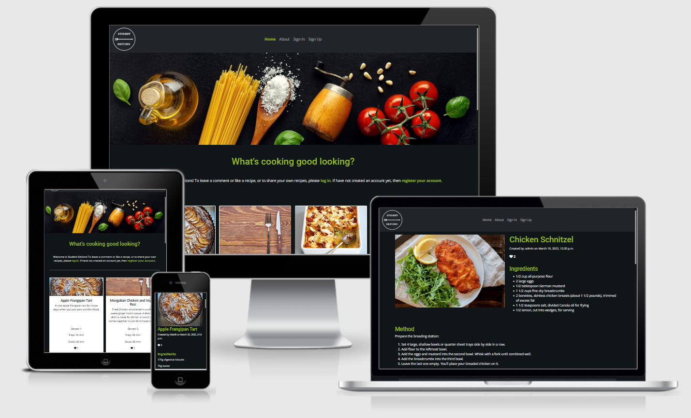

# Student Rations



[View the live project here](https://student-rations.herokuapp.com/ "Link to deployed link - Student Rations")

## Table of contents
1. [Introduction](#Introduction)
2. [UX](#UX)
    1. [Ideal User Demographic](#Ideal-User-Demographic)
    2. [User Stories](#User-Stories)
    3. [Development Planes](#Development-Planes)
    4. [Design](#Design)
3. [Features](#Features)
    1. [Design Features](#Design-Features) 
    2. [Existing Features](#Existing-Features)
    3. [Features to Implement in the future](#Features-to-Implement-in-the-future)
4. [Issues and Bugs](#Issues-and-Bugs)
5. [Technologies Used](#Technologies-Used)
     1. [Main Languages Used](#Main-Languages-Used)
     2. [Additional Languages Used](#Additional-Languages-Used)
     3. [Frameworks, Libraries & Programs Used](#Frameworks,-Libraries-&-Programs-Used)
6. [Testing](#Testing)
     1. [Testing.md](TESTING.md)
7. [Deployment](#Deployment)
     1. [Deploying on Heroku](#Deploying-on-Heroku)
     2. [Forking the Repository](#Forking-the-Repository)
     3. [Creating a Clone](#Creating-a-Clone)
8. [Credits](#Credits)
     1. [Content](#Content)
     2. [Media](#Media)
     3. [Code](#Code)
9. [Acknowledgements](#Acknowledgements)
***

## Introduction
This website was designed to display simple recipes for the student population. The focus of the site is to allow users to upload recipes and images for other users to search and use. 

Users will also be able to comment on recipes and upload images of their attempts at the recipe.

This is the fourth of five  Portfolio Projects that the developer must complete during their Full Stack Software Development (with eCommerce) Program at The Code Institute.

The main requirements were to build a Full-Stack site based on business logic used to control a centrally-owned dataset. This also requires the developer to set up an authentication mechanism and provide role-based access to the site's data or other activities based on the dataset.


[Back to top ⇧](#Student-Rations)

## UX 

### Ideal User Demographic
#### The ideal user of this website is:
- Students
- Parents
- Budgeting Individuals
- Cooking Enthusiasts

### User Stories
#### Users:
1. As a **user**, I can **view a paginated list of recipes** so that **I can more easily select a recipe to view**.

2. As a **user**, I can **view a list of recipes** so that **I can select one to make**.

3. As a **user**, I can **open a recipe** so that **I can see the required 
ingredients and steps to make the meal**.

4. As a **user**, I can **view the number of likes on a recipe** so that **I can decide if this recipe is worth trying**.

5. As a **user**, I can **read comments other users have left on a recipe** so that **I can see tips and reviews of the recipe**.

6. As a **user**, I can **register an account** so that **I can submit recipes or comment on and like others' recipes**.

7. As a **user**, I can **leave comments on recipes** so that **I can give tips for the recipe or review the recipe**.

8. As a **user**, I can **like or unlike a recipe or comment** so that **I can interact with the content**.

9. As a **user**, I can **upload images to the comments section** so that **I can show my attempts to replicate the recipe**.

10. As a **user**, I can **add recipes to a favourites page** so that **I can easily find the recipes again for future use**.

#### Site Admin:
1. As a **Site Admin**, I can **create, read, update and delete recipes** so that **I can manage my site content**.

2. As a **Site Admin**, I can **create drafts** so that **I can finish writing my site content later**.

### Development Planes
To create a comprehensive and appealing website, the developer researched other recipe based websites to discover what features and functionality would be required. This information created the above user stories and is developed further below.

#### Strategy
Broken into three categories, the website will attempt to focus on the following target audiences:
- **Roles:**
     - User
     - Admin

- **Demographic:**
     - Young adults
     - College/University students
     - Cooking Enthusiasts
     - People looking for budget meals

- **Psychographics:**
     - Personality & Attitudes:
        - Creative
	    - Outgoing
	    - Young
	    - Thrifty
     - Values:
        - Budget-minded
	    - Love of good food
     - Lifestyles:
        - Students
	    - Low-income families
	    - Interested in homemade food

The website needs to enable the **user** to:
- search for recipes.
- comment on and like recipes.
- upload images of their own experience using the recipe.
- register and log in to enable them to upload their recipes.
- add recipes to a favourites page.

The website needs to enable the **admin** to:
- approve recipe uploads.
- create drafts so they can be completed later.

With the user stories in mind, the developer created the below strategy table to determine the trade-off of importance and viability with the following results:


#### Scope
A scope was defined to identify what needed to be done to align features with the strategy previously defined. This was broken into two categories:
- **Content Requirements**
     - The user will be looking for:
        - a comprehensive list of recipes.
	    - a comprehensive list of ingredients and steps to follow.
	    - a list of comments and images of others' attempts to replicate the meal on each recipe page.
	    - a page to find all their favourite recipes.

- **Functionality Requirements**
     - The user will be able to:
        - Easily navigate the site to find the information they want.
	    - Be able to select recipes they wish to try.
	    - Comment on and like recipes.
	    - Upload images in the comments section to show their results of trying the recipe.

#### Structure
The information architecture was organized in a hierarchical tree structure to ensure that users could navigate through the site with ease and efficiency, with the following results


#### Skeleton 
Wireframe mockups were created using [Balsamiq](https://balsamiq.com/ 'Balsamiq Website'), providing a positive user experience with the following results:

Home Page:


About Page:


Search Page:


Recipe Page:


Favourites Page:


### Design

#### Colour Scheme
The developer chose to use a clean black and white style page, with flashes of green throughout to hint towards healthy edible greens. This colour scheme was chosen as it is quite modern and it allows the colours from the recipes to be presented clearly and appear more attractive.

The black and white colouring gives a very clean and clear view of the site content. The dark background is easier on the eyes, which for students can become quite strained due to their studies.

#### Typography
The font chosen for the logo was Courier New Bold as it is clear and concise, without any frills. This font was chosen as a representation of the site, showing clear concise recipes without all the added articles discussing each ingredient. This Logo was created by the developer using [GNU Image Manipulation Program (GIMP)](https://www.gimp.org/ 'GIMP Website')

The fonts chosen for this site are Roboto, for the headings, and Open Sans, for all other text, as these are popular and clear fonts that work well with the design of the site. Both of their fonts were chosen from [Google Fonts](https://fonts.google.com/ 'Google Fonts Website')

 Roboto from Google Fonts was chosen as it is a clean and concise font. For the paragraph text, the font Open Sans from Google Fonts was chosen as it is a popular font that is also clean and concise.

#### Imagery
To match the colour scheme chosen, an image of some food and utensils on a dark background was chosen. This image has a few basic ingredients and gives a less threatening appearance to students who may be nervous about trying new recipes. On each recipe page, an image of the finished meal is shown with the recipe to allow the user to visualise the end product.

[Back to top ⇧](#Student-Rations)

## Features

### Design Features
Each page of the website features a consistent responsive navigational system:

- The **Header** contains a conventionally placed logo in the top left of the page (whereby clicking this will redirect users back to the home page) and a navigation bar in the centre of the header. On smaller screens, the navigation bar condenses into a dropdown with navigation options.

- There is a **Header Image** on most pages, depicting a selection of ingredients and utensils on a dark background. This image is used to keep the theme consistent and is only missing in the recipe pages where the focus is instead brought to an image of the recipe itself, or a placeholder if none is provided.

- The **Footer** is divided into five sections, four columns and a bottom row. The first column contains a short blurb, telling the user about the site. The second contains useful links to utensil shopping, budgeting ideas and more. The third has navigation links to the Student Rations site. The fourth has a list of contact information. Finally, the bottom row contains social links and copyright information. On smaller screens, this condenses into a single column, with each section moving underneath its neighbour on the left.

<dl>
  <dt><a href="https://student-rations.herokuapp.com/" target="_blank" alt="Home Page">Home Page</a></dt>
  <dd>The Home Page is laid out with a nav section on top, an image below the width of the screen, the content area containing the recipe cards, followed by the footer. The features are as follows:
     <ul>
          <li><strong>A Welcome Note or Login Request</strong> - On the home screen you will see, below the header image, either a request to log in or register to the site or a heading welcoming the user to the site, citing the user's username.
          </li>
          <li><strong>Recipe Cards</strong> - The main content has recipe cards that are four cards across on large screens, two across on medium screens and one across on small screens. This is paginated by eight so anything more than eight cards will be shown on the next page.
          </li>
          <li><strong>Next/Prev Page Link</strong> - If more than eight recipes are available, the remainder will be shown on the next page, with a max of eight cards on each of the following pages. To access these, there is a Next or Prev link that shows underneath the recipe cards.
          </li>
     </ul>
  </dd>

  <dt><a href="https://student-rations.herokuapp.com/about/" target="_blank" alt="About Page">About Page</a></dt>
  <dd>The about page shows a brief overview of the developer and their story:
     <ul>
          <li><strong>Content</strong> - There is information about the developer and their story on this page.
          </li>
     </ul>
  </dd>

  <dt><a href="https://student-rations.herokuapp.com/creamy-courgette-lasagne/" target="_blank" alt="Recipe Page - Creamy courgette lasagne">Recipe Page</a></dt>
  <dd>This page shows the details of each recipe. This page does not contain a header image but is instead divided into two sections on top, followed by a single column section and commenting section underneath. The features are as follows:
     <ul>
          <li><strong>Featured Image</strong> - The featured image shows the image the user uploaded, or the placeholder image if no image was uploaded by the user.
          </li>
          <li><strong>Like/Unlike Button</strong> - If the user is logged in, the like/unlike button will appear green and will allow the user to like the recipe. If they have already liked the recipe, clicking the button will remove the like.
          </li>
          <li><strong>Edit/Delete Buttons</strong> - If the user is logged in and is the author of the said recipe, clicking the edit button will bring the user to the edit page. The recipe details are populated into the form and the user can edit the information, upload a new image and save the information. Alternatively, clicking the delete button removes the recipe from the database and redirects the user back to the home page.
          </li>
          <li><strong>Comment Feature</strong> - If the user is logged in, the comment form is visible under the recipe on the right of the page. Entering a comment and submitting will then cause the form to disappear and a message will show advising the comment is awaiting approval. On approval, comments are displayed under the recipe on the left of the page, showing the user's name and date and time of commenting.
          </li>
     </ul>
  </dd>

  <dt><a href="https://student-rations.herokuapp.com/edit-a-recipe/creamy-courgette-lasagne" target="_blank" alt="Edit Recipe Page - Creamy courgette lasagne">Edit Recipe Page</a></dt>
  <dd>This page shows the form populated with the specific recipe's information which can be saved and edited:
     <ul>
          <li><strong>Edit Recipe Form</strong> - The form is prepopulated with all the recipe information. The user can edit this information, only if they are the author of the recipe. Saving this recipe redirects the user to the home page where they can then view the recipe list.
          </li>
     </ul>
  </dd>

  <dt><a href="https://student-rations.herokuapp.com/share-a-recipe/" target="_blank" alt="Share a Recipe Page">Share a Recipe Page</a></dt>
  <dd>This page has a form that allows the user to add a recipe, as well as upload an image:
     <ul>
          <li><strong>Share a Recipe Form</strong> - An empty form is displayed, allowing the user to enter the recipe details, as well as upload an image of the recipe. If no image is uploaded, the placeholder image is saved instead. Saving this recipe redirects the user to the home page where they can then view the recipe list.
          </li>
     </ul>
  </dd>

  <dt><a href="https://student-rations.herokuapp.com/accounts/login/" target="_blank" alt="Sign In Page">Sign In Page</a></dt>
  <dd>This page has a form allowing the user to enter their username and password to log in:
     <ul>
          <li><strong>Sign In Form</strong> - This form has two input fields, for the username and the password. A submit button at the end of the form login the user in, if the information was correct, and redirects the user to the home page.
          </li>
     </ul>
  </dd>
  
  <dt><a href="https://student-rations.herokuapp.com/accounts/logout/" target="_blank" alt="Sign Out Page">Sign Out Page</a></dt>
  <dd>The :
     <ul>
          <li><strong>Sign Out Button</strong> - This page asks the user if they are sure they want to log out. Clicking the Sign Out button will log the user out and redirect them to the home page.
          </li>
     </ul>
  </dd>
  
  <dt><a href="https://student-rations.herokuapp.com/accounts/signup/" target="_blank" alt="Sign Up Page">Sign Up Page</a></dt>
  <dd>This page has a form allowing the user to enter their username, email and password to register an account:
     <ul>
          <li><strong>Sign In Form</strong> - This form has four input fields, for the username, email address (optional), the password and repeat the same password. A submit button at the end of the form login the user in if the information was correct and has not been used by other users previously, and redirects the user to the home page.
          </li>
     </ul>
  </dd>
</dl>
 
### Existing Features
- **Header Logo** - Appearing on every page for brand recognition. Clicking the logo will return the users to the home page, as expected.
- **Header Navigation Bar** - Appearing on every page for a consistently easy and intuitive navigable system.
- **Header Image** - Appearing on almost every page, the image gives a consistent theme and style throughout the site.
- **Social Icons** - Appearing on every page, the icons are appropriate representations of the Social Media platforms, found in the footer.
- **Recipe Cards** - Appearing on the home page, the recipe cards give a brief overview of the recipe, showing the image, description, servings, prep and cook time, and the number of likes on the recipe.
- **Recipe Form** - Appearing on the share a recipe page and edit recipe page, the form allows the user to add or edit a recipe, including adding an image to display on the recipe page and recipe card.
- **Comment Form** - Appearing on the recipe page, the form submits the user's comment to be approved by the admin.
- **Comments Section** - Appearing on the recipe page, approved comments are displayed showing the author's username and the date and time of submission.
- **Like/Unlike Button** - Appearing on the recipe page when the user is logged in, the button allows the user to like or unlike a recipe. If the user is not logged in, they will simply see the number of likes on the page.
- **Home Page** - A home page that shows the user the site's available recipes, shown as recipe cards and paginated by eight. There is a next/prev button under the recipes allowing the user to explore all recipes. In addition, if the user is logged in, a welcome message appears on the home page with the user's username. Otherwise, a short message recommending the user logs in or registers an account is shown.
- **About Page** - An About Page gives the user information about the developer and their story.
- **Recipe Page** - A recipe page whose content changes with the recipe details of the chosen recipe. Includes features to like and comment as well as edit or delete.
- **Add/Edit Recipe Page** - A page designed to allow the user to add a recipe if logged in, and edit a recipe if they are logged in as the recipe's author. 
- **Sign In Page** - A page designed to allow the user to log in using previously created user details; a username and a password.
- **Sign Up Page** - A page designed to allow the user to create a user profile using a username, optional email address and a password that needs to be repeated to ensure it is correct.
- **Sign Out Page** - A page designed to confirm the user wishes to log out of their account. If the user clicks the sign out button, they are then redirected to the home page.

### Features to Implement in the future
- **Favourites Page**
     - **Feature** - This feature would have been used to display all the recipes a user would have liked so the user could find them easier.
     - **Reason for not featuring in this release** - The reason for not releasing this feature was that the developer ran out of time to implement the feature before the project's due date. This will be developed further in the future after grading is complete.
- **Sharing Images in Comments**
     - **Feature** - This feature would have allowed users to upload images of their attempts at the recipes in the comments section next to their comment.
     - **Reason for not featuring in this release** - Again, the developer ran out of time to implement this feature before the project's due date. This will also be developed further in the future after grading is complete.
- **Saving Drafts to a Profile Page**
     - **Feature** - This feature would have allowed users to create a draft of a recipe which would be saved on a profile page which would allow them to complete the draft at a later date and release the recipe onto the site.
     - **Reason for not featuring in this release** - Once again, the developer ran out of time to implement this feature before the project's due date. This will also be developed further in the future after grading is complete.
 
[Back to top ⇧](#Student-Rations)

## Issues and Bugs 
Sample text about bugs

**Bug** - The developer initially thought that since Summernote worked on the admin page, it would work on the main site also. The developer was relying on Summernote being available on the recipe form as it would allow the user to create ordered and unordered lists for steps and ingredients. 
- ***Solution***: The developer inspected all summernote documentation, on both their site and GitHub page. After discussing the issue with tutor support, it was found that the summernote documentation was lacking in information, focussing mostly on admin implementation. Tutor support was able to provide information regarding settings to be implemented as well as add the correct JS script at the bottom of the required pages. With the recommended in place, the summernote feature was working on the create/edit recipe pages and was able to be styled by the developer.

**Bug** - The developer had a bug appear which prevented the author's username from saving when the recipe form was submitted.
- ***Solution***: The developer found that the incorrect field was being selected. This was rectified by correcting the code from "recipe.user = request.user" to "recipe_form.author = request.user". Once the correct field was selected, the author's name was saved when the form was submitted.

**Bug** - The developer found that when submitting a recipe, it did not appear on the home screen as a recipe card.
- ***Solution***: After looking at the admin page, it was found that submitted recipes were saved as drafts, which were then inaccessible to the user to mark as published. The developer added a line of code in views.py which changed the publish status of the recipes as published once saved. That code was "recipe_form.status = 1". 

**Bug** - The developer found that the site was not deploying to Heroku after the early deployment was completed.
- ***Solution***: It was found that the app name was referenced in the Procfile instead of the project name. Correcting this error from "web: gunicorn recipes.wsgi" to "web: gunicorn student_rations.wsgi" fixed this issue and allowed the developer to successfully deploy to Heroku.

**Bug** - The developer found a bug that caused an error if two recipes were added with the same name. This was caused by the slugs, created at the time the recipe was submitted, which were identical meaning the site could not differentiate which recipe was to be opened.
- ***Solution***: The developer created a function that checked if the slug was already created. If so, a series of four randomly generated characters would be added to the end of the slug, creating a unique slug for each recipe.

**Bug** - The developer found that the Summernote feature, while still working on the main site, had stopped working in the admin panel. This caused the textareas to become hidden. This became an issue as the admin could no longer interact with the description, direction or ingredient fields on the recipes.
- ***Solution***: The developer found that the recipe section in admin.py had been altered, causing it to reference "summernote = ('content',)" rather than "summernote_field = ('content',)". Correcting this brought the textareas back to the admin panel so the recipes could once again be edited as needed.

**Issue** - The developer found while validating the site's html that the Summernote feature implemented in the forms threw up a large number of errors. Unfortunately this is not something the developer was able to rectify and as such was left in the code. It will be noted that these errors were not caused by the developer and as such should hopefully not count toward the final grade.

**Issue** - The developer found errors when validating the python files. This was found in the settings.py file where certain urls went beyond the character limit on a single line. This error can be ignored as there is no way to reduce the url length to conform to the character limit per line.

[Back to top ⇧](#Student-Rations)

## Technologies Used
### Main Languages Used
- [HTML5](https://en.wikipedia.org/wiki/HTML5 "Link to HTML Wiki")
- [CSS3](https://en.wikipedia.org/wiki/Cascading_Style_Sheets "Link to CSS Wiki")

### Additional Languages Used
- [JavaScript](https://en.wikipedia.org/wiki/JavaScript "Link to JavaScript Wiki")
     - Used to implement the Summernote feature that allowed the user to add styling to the recipe in the form.
- [Python](https://en.wikipedia.org/wiki/Python_(programming_language) "Link to Python Wiki")
     - Used to implement Django functionality, including building models, forms and views for our app.

### Frameworks, Libraries & Programs Used
- [Django](https://www.djangoproject.com/ "Link to Django Project website")
    - Django was used to build the models, forms and views of the app, and was the backbone of this project.
- [Bootstrap](https://getbootstrap.com/docs/5.0/getting-started/introduction/ "Link to Bootstrap page")
     - Bootstrap was used to implement the responsiveness of the site, using bootstrap classes.
- [Cloudinary](https://cloudinary.com/ "Link to Cloudinary page")
     - Cloudinary was used as free cloud storage for images uploaded to the site through the recipe forms.
- [Summernote](https://summernote.org "Link to Summernote page")
     - Summernote was used to allow users to add styling when adding a recipe to the site. This is particularly useful for using bullet points for ingredients or numbering the steps for the recipe.
- [Google Fonts](https://fonts.google.com/ "Link to Google Fonts")
    - Google fonts were used to import the fonts "Roboto" and "Open Sans" into the style.css file. These fonts were used throughout the project.
- [Font Awesome](https://fontawesome.com/ "Link to FontAwesome")
     - Font Awesome was used on all pages throughout the website to import icons (e.g. social media icons) for UX purposes.
- [Git](https://git-scm.com/ "Link to Git homepage")
     - Git was used for version control by utilizing the GitPod terminal to commit to Git and push to GitHub.
- [GitHub](https://github.com/ "Link to GitHub")
     - GitHub was used to store the project after pushing
- [Am I Responsive?](http://ami.responsivedesign.is/# "Link to Am I Responsive Homepage")
     - Am I Responsive was used to see responsive design throughout the process and to generate mockup imagery to be used.

[Back to top ⇧](#Student-Rations)

## Testing

Testing information can be found in a separate [testing file](TESTING.md "Link to testing file").

## Deployment

This project was developed using a [GitPod](https://gitpod.io/ "Link ot GitPod") workspace. The code was commited to [Git](https://git-scm.com/ "Link to Git") and pushed to [GitHub](https://github.com/ "Link to GitHub") using the terminal.

### Deploying on Heroku
To deploy this page to Heroku from its GitHub repository, the following steps were taken:

1. Create the Heroku App:
    - Select "Create new app" in Heroku.
    - Choose a name for your app and select the location.

2. Attach the Postgres database:
    - In the Resources tab, under add-ons, type in Postgres and select the Heroku Postgres option.

3. Prepare the environment and settings.py file:
    - In the Settings tab, click on Reveal Config Vars and copy the url next to DATABASE_URL.
    - In your GitPod workspace, create an env.py file in the main directory. 
    - Add the DATABASE_URL value and your chosen SECRET_KEY value to the env.py file.
    - Add the SECRET_KEY value to the Config Vars in Heroku.
    - Update the settings.py file to import the env file and add the SECRETKEY and DATABASE_URL file paths.
    - Update the Config Vars with the Cloudinary url, adding into the settings.py file also.
    - In settings.py add the following sections:
        - Cloudinary to the INSTALLED_APPS list
        - STATICFILE_STORAGE
        - STATICFILES_DIRS
        - STATIC_ROOT
        - MEDIA_URL
        - DEFAULT_FILE_STORAGE
        - TEMPLATES_DIR
        - Update DIRS in TEMPLATES with TEMPLATES_DIR
        - Update ALLOWED_HOSTS with ['app_name.heroku.com', 'localhost']

4. Store Static and Media files in Cloudinary and Deploy to Heroku:
    - Create three directories in the main directory; media, storage and templates.
    - Create a file named "Procfile" in the main directory and add the following:
        - web: gunicorn project-name.wsgi
    - Go to Deploy tab on Heroku and connect to the GitHub, then to the required recpository.
    Click on Delpoy Branch and wait for the build to load. When the build is complete, the app can be opened through Heroku.


### Forking the Repository
By forking the GitHub Repository we make a copy of the original repository on our GitHub account to view and/or make changes without affecting the original repository by using the following steps...

1. Log into [GitHub](https://github.com/login "Link to GitHub login page") or [create an account](https://github.com/join "Link to GitHub create account page").
2. Locate the [GitHub Repository](https://github.com/rebeccatraceyt/KryanLive "Link to GitHub Repo").
3. At the top of the repository, on the right side of the page, select "Fork"
4. You should now have a copy of the original repository in your GitHub account.

### Creating a Clone
How to run this project locally:
1. Install the [GitPod Browser](https://www.gitpod.io/docs/browser-extension/ "Link to Gitpod Browser extension download") Extension for Chrome.
2. After installation, restart the browser.
3. Log into [GitHub](https://github.com/login "Link to GitHub login page") or [create an account](https://github.com/join "Link to GitHub create account page").
2. Locate the [GitHub Repository](https://github.com/rebeccatraceyt/KryanLive "Link to GitHub Repo").
5. Click the green "GitPod" button in the top right corner of the repository.
This will trigger a new gitPod workspace to be created from the code in github where you can work locally.

How to run this project within a local IDE, such as VSCode:

1. Log into [GitHub](https://github.com/login "Link to GitHub login page") or [create an account](https://github.com/join "Link to GitHub create account page").
2. Locate the [GitHub Repository](repo url "Link to GitHub Repo").
3. Under the repository name, click "Clone or download".
4. In the Clone with HTTPs section, copy the clone URL for the repository.
5. In your local IDE open the terminal.
6. Change the current working directory to the location where you want the cloned directory to be made.
7. Type 'git clone', and then paste the URL you copied in Step 3.
```
git clone https://github.com/USERNAME/REPOSITORY
```
8. Press Enter. Your local clone will be created.

Further reading and troubleshooting on cloning a repository from GitHub [here](https://docs.github.com/en/free-pro-team@latest/github/creating-cloning-and-archiving-repositories/cloning-a-repository "Link to GitHub troubleshooting")

[Back to top ⇧](#Student-Rations)

## Credits 

### Content
- Some recipes were taken from other recipe sites, generated by the site '[God Dammit What Do You Want?](http://www.dammitwhatdoyouwant.co.uk/ "Link to the site God Dammit What Do You Want?")'. The remaining content was created by the developer.

### Media
- The images have been sourced by users and also from the [Pixabay](https://pixabay.com/) by the developer.
- The text was created by both users and the3 developer. The users have added recipes and comments. The developer has also added recipes from recipe websites sourced through the website '[God Dammit What Do You Want?](http://www.dammitwhatdoyouwant.co.uk/ "Link to the site God Dammit What Do You Want?")'. The remaining text content was generated by the developer.

### Code 
Did the developer use outside references when building code?
- [Stack Overflow](https://stackoverflow.com/ "Link to Stack Overflow page")
- [Bootstrap](https://getbootstrap.com/ "Link to BootStrap page")
- [Django Docs](https://docs.djangoproject.com/en/3.2/ "Link to Django's Docs for Version 3.2")
- [Summernote GitHub Docs](https://github.com/summernote/summernote, "Link to Summernote's GitHub page")
- etc.


[Back to top ⇧](#Student-Rations)

## Acknowledgements

- I would like to thank my friends and family for their valued opinions and critic during the process of design and development.
- I would also like to thank my mentor, Chris Quinn, for their invaluable help and guidance throughout the process.
- Finally, I would like to thank all the wonderful people in Student Support who helped me find solutions to issues in my code.

[Back to top ⇧](#Student-Rations)

***
