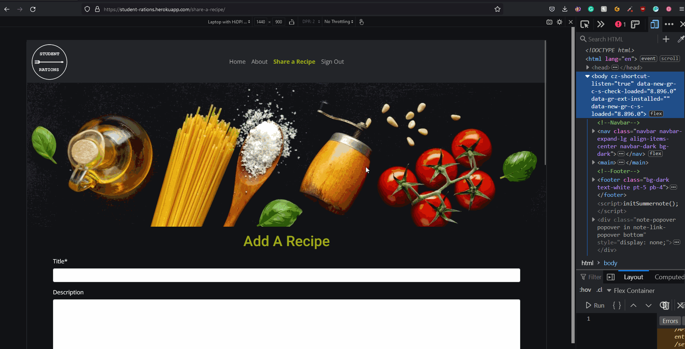
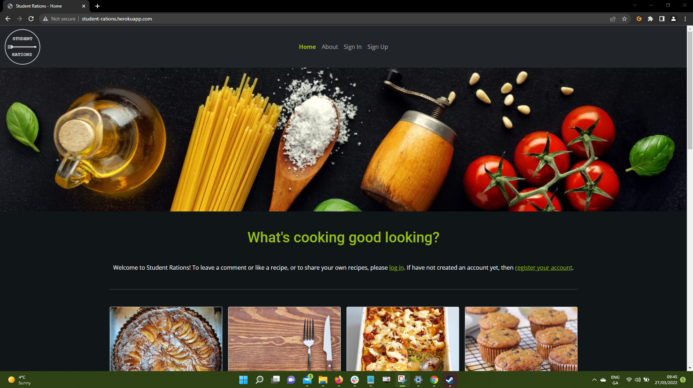

# Student Rations - Testing 

[Main README.md file](/README.md)

[View live project](https://student-rations.herokuapp.com/)

[View GitHub repository](https://github.com/Irishbecky91/student_rations)

***
## Table of contents
1. [Testing User Stories](#Testing-User-Stories)
2. [Manual Testing](#Manual-Testing)
3. [Automated Testing](#Automated-Testing) 
     - [Code Validation](#Code-Validation)
     - [Browser Validation](#Browser-Validation)
4. [User Testing](#User-Testing)

***

## Testing User Stories

#### User Stories:
1. As a **user**, I can **view a paginated list of recipes** so that **I can more easily select a recipe to view**.
  
    - The list of recipes on the home page has been paginated by eight. If there are more than eight recipes, the remainder moves to the next page. This will continue until there are eight or less recipe cards on the one page.

2. As a **user**, I can **view a list of recipes** so that **I can select one to make**.
    
    - The layout shows two rows of four cards on large screens, four rows of two cards on medium screens, and eight rows of a single card on small screens.

3. As a **user**, I can **open a recipe** so that **I can see the required 
ingredients and steps to make the meal**.
  
    - On each recipe card is a brief overview of the recipe and a button that, when clicked, redirects the user to the recipe page.

4. As a **user**, I can **view the number of likes on a recipe** so that **I can decide if this recipe is worth trying**.

    - On the recipe cards, the total number of likes on the recipe is displayed. This is also shown on the recipe page itself.

5. As a **user**, I can **read comments other users have left on a recipe** so that **I can see tips and reviews of the recipe**.

    - A comments section has been added to the recipe pages, showing the author's username and the date/time the comment was left.

6. As a **user**, I can **register an account** so that **I can submit recipes or comment on and like others' recipes**.

    - There is a sign in and sign up option, which advises the user on the home page to log in to access certain content. The user will be required to be signed in to access protected content, such as the like and comment features.

7. As a **user**, I can **leave comments on recipes** so that **I can give tips for the recipe or review the recipe**.

    - If the user is logged in, the comment form will become visible. Once the user submits a comment, the comment will need to be approved by the admin to then be displayed on the site.

8. As a **user**, I can **like or unlike a recipe or comment** so that **I can interact with the content**.

    - If the user is logged in, the like feature will appear as a green button, allowing the user to like or remove their like from the recipe. The number of likes is automatically incremented and the change is visible both on the recipe page and the recipe card on the home page.

9. As a **user**, I can **upload images to the comments section** so that **I can show my attempts to replicate the recipe**.

    - Unfortunately this feature was not implemented by the developer and will require future development.

10. As a **user**, I can **add recipes to a favourites page** so that **I can easily find the recipes again for future use**.

    - Unfortunately this feature was not implemented by the developer and will require future development.

[Back to top](#Student-Rations---Testing)

## Manual Testing

### Common Elements Testing
Manual testing was conducted on the following elements that appear on every page:

- Test that Logo redirects to home screen.

    

- Test that Nav Links work.

    

- Test that Footer Links work.

    

- Test that Social Links work.

    

### Home Page
Manual testing was conducted on the following elements of the [Home Page](https://student-rations.herokuapp.com/):
     
- Test that user welcome message displays username.

    

- Test that recipe cards redirect user to recipe pages.

    

### Recipe Page/Edit Recipe Page
Manual testing was conducted on the following elements of the [Recipe Page](https://student-rations.herokuapp.com/best-ever-chocolate-brownies-recipe/) and [Edit Recipe Page](https://student-rations.herokuapp.com/edit-a-recipe/best-ever-chocolate-brownies-recipe):

- Test that recipes can be edited by author only.

    

- Test that recipes can only be deleted by author.

    
     
- Test that recipes can be liked and unliked when logged in.

    
     
- Test that comments can be submitted and approved.

    

### Share Recipe Page
Manual testing was conducted on the following elements of the [Share recipe Page](https://student-rations.herokuapp.com/share-a-recipe/):

- Test that recipes create unique slugs

    
     
- Test that recipes are saved.

    
     
### Sign in/Sign Out/Sign Up Pages
Manual testing was conducted on the following elements of the [Sign In Page](Link), [Sign Out Page](Link) and [Sign Up Page](Link):

- Users can register, log in and logout.

    

### Pages are Responsive
- Manual testing was conducted on the following pages for responsiveness on large, medium and small screens

    

    

    

    

    

[Back to top](#Student-Rations---Testing)

## Automated Testing

### Code Validation
The [W3C Markup Validator](https://validator.w3.org/ "Link to M£C Markup Validator Site") service was used to validate the `HTML` and `CSS` code used. The [PEP8 Python Validator](http://pep8online.com/ "Link to the PEP8 Python Validator Site") was used to validate the `Python`code used.

**Results:**

- HTML Pages

HTML Pages - Code Validation

- CSS stylesheet

CSS Stylesheet - Code Validation

- Python Files

Python Files - Code Validation

### Browser Validation
- **Chrome** - 
- **Edge** - 
- **Opera** - 
- **Firefox** - 

## User testing 
My husband and the lovely people of Slack were asked to review the site and documentation to point out any bugs and/or user experience issues. Their helpful advice throughout the process led to a few small UX changes in order to create a better experience. 

[Back to top ⇧](#Student-Rations---Testing)

***
